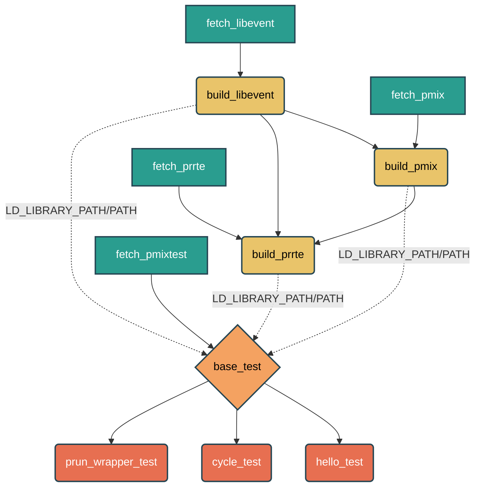

# PMIx  ReFrame Test

This repository contains a [ReFrame](https://reframe-hpc.readthedocs.io/en/stable/)-based test  designed to build and test the PMIx component.

To ensure that all necessary headers and libraries are present and compatible, the suite fully bootstraps its environment by building its core dependencies (`libevent`, `PMIx`, and `PRRTE`) from scratch before executing the actual tests.

## File Structure & Components

The test suite is divided into modular ReFrame fixtures and tests, separated by files:

1. **`libevent_build_class.py`**:
   - **`fetch_libevent`**: Downloads the `libevent` source tarball.
   - **`build_libevent`**: Extracts and compiles `libevent` using Autotools. Acts as the base dependency for the rest of the stack.

2. **`pmix_build_class.py`**:
   - **`fetch_pmix`**: Downloads the `openpmix` source tarball.
   - **`build_pmix`**: Compiles PMIx, explicitly linking it against the locally built `libevent` fixture.

3. **`prrte_build_class.py`**:
   - **`fetch_prrte`**: Downloads the `prrte` (PMIx Reference Run Time Environment) source tarball.
   - **`build_prrte`**: Compiles PRRTE, linking it against both the locally built `libevent` and `PMIx` fixtures.

4. **`run_pmix_test.py`**:
   - **`fetch_pmixtest`**: Clones the `openpmix/pmix-tests` GitHub repository.
   - **`base_test`**: The base ReFrame class for the test runs. It depends on all previous build fixtures (`build_prrte`, `build_pmix`, `build_libevent`) and configures `PATH` and `LD_LIBRARY_PATH` dynamically to ensure the tests use the locally built binaries and libraries.
   - **Individual Tests**:
     - `hello_test`
     - `cycle_test`
     - `prun_wrapper_test`
     - *(These tests inherit from `base_test`, navigate to the respective test folders in the cloned repository, trigger their build script, and run them.)*

## Dependency Graph

The entire execution flow of this test suite relies heavily on ReFrame's fixture infrastructure. Below is the dependency graph showing how components are downloaded, built, and linked together:

### Execution Flow Summary:
1. **Download Phase**: Source code for `libevent`, `pmix`, `prrte`, and `pmix-tests` are downloaded independently.
2. **Build Phase**: 
   - `libevent` builds first.
   - `pmix` builds next, dependent on `libevent`.
   - `prrte` builds last, requiring both `libevent` and `pmix`.
3. **Setup Phase**: The `base_test` injects the built bin/lib paths into the runtime environment block.
4. **Test Phase**: `hello_world`, `cycle`, and `prun-wrapper` tests compile their local binaries and execute exactly matching the prepared environment constraints.
